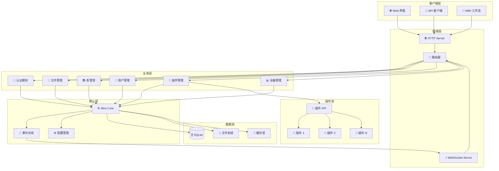
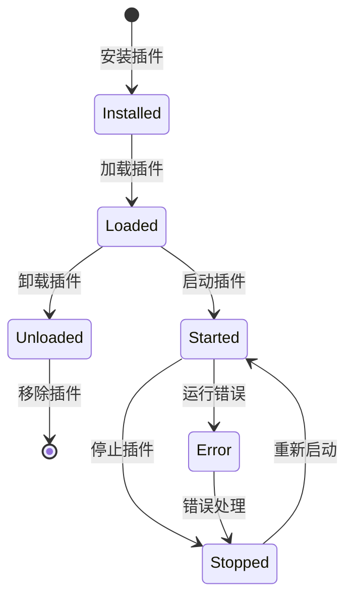

# 🏗️ 系统架构

深入了解 Mira 的技术架构和设计理念，帮助你更好地理解和使用系统。

## 🎯 设计理念

Mira 的架构设计遵循以下核心理念：

### 🔧 模块化设计
- **高内聚低耦合**：各模块职责明确，相互依赖最小
- **可扩展性**：通过插件系统支持功能扩展
- **可维护性**：清晰的代码结构，易于维护和升级

### 🌐 分层架构
- **表现层**：Web 界面和 API 接口
- **业务层**：核心业务逻辑处理
- **数据层**：数据存储和管理
- **插件层**：扩展功能和第三方集成

### 🔄 事件驱动
- **实时响应**：基于事件的异步处理
- **松耦合**：通过事件总线解耦组件
- **可观测性**：全链路事件追踪和监控

## 🏢 整体架构



## 📦 核心组件详解

### 🖥️ Mira Server

Mira Server 是系统的主要入口点，负责：

- **🌐 HTTP 服务**：处理 RESTful API 请求
- **⚡ WebSocket 服务**：提供实时通信能力
- **🔀 请求路由**：将请求分发到对应的业务模块
- **🔐 身份验证**：统一的认证和授权管理
- **📊 监控统计**：收集和报告系统运行状态

```typescript
// 服务器启动流程
class MiraServer {
  async start() {
    // 1. 初始化配置
    await this.initConfig()
    
    // 2. 启动数据库
    await this.initDatabase()
    
    // 3. 加载插件
    await this.loadPlugins()
    
    // 4. 启动 HTTP 服务
    await this.startHttpServer()
    
    // 5. 启动 WebSocket 服务
    await this.startWebSocketServer()
    
    // 6. 注册事件监听器
    this.registerEventListeners()
  }
}
```

### ⚙️ Mira Core

Mira Core 是系统的核心，包含所有业务逻辑：

#### 📁 文件管理器
```typescript
interface FileManager {
  // 文件操作
  upload(file: File, options: UploadOptions): Promise<FileInfo>
  download(path: string): Promise<Stream>
  delete(path: string): Promise<void>
  
  // 目录操作
  createDirectory(path: string): Promise<void>
  listDirectory(path: string): Promise<FileInfo[]>
  
  // 文件信息
  getFileInfo(path: string): Promise<FileInfo>
  updateFileInfo(path: string, info: FileInfo): Promise<void>
}
```

#### 📚 库管理器
```typescript
interface LibraryManager {
  // 库操作
  createLibrary(config: LibraryConfig): Promise<Library>
  updateLibrary(id: string, config: LibraryConfig): Promise<Library>
  deleteLibrary(id: string): Promise<void>
  
  // 库查询
  getLibrary(id: string): Promise<Library>
  listLibraries(filter?: LibraryFilter): Promise<Library[]>
  
  // 库服务
  startLibrary(id: string): Promise<void>
  stopLibrary(id: string): Promise<void>
}
```

#### 👥 用户管理器
```typescript
interface UserManager {
  // 用户认证
  login(username: string, password: string): Promise<AuthResult>
  logout(token: string): Promise<void>
  
  // 用户管理
  createUser(userInfo: UserInfo): Promise<User>
  updateUser(id: string, userInfo: UserInfo): Promise<User>
  deleteUser(id: string): Promise<void>
  
  // 权限管理
  getPermissions(userId: string): Promise<Permission[]>
  setPermissions(userId: string, permissions: Permission[]): Promise<void>
}
```

#### 🔌 插件管理器
```typescript
interface PluginManager {
  // 插件生命周期
  loadPlugin(pluginPath: string): Promise<Plugin>
  unloadPlugin(pluginId: string): Promise<void>
  
  // 插件状态
  startPlugin(pluginId: string): Promise<void>
  stopPlugin(pluginId: string): Promise<void>
  
  // 插件查询
  getPlugin(id: string): Promise<Plugin>
  listPlugins(): Promise<Plugin[]>
}
```

### 📢 事件系统

Mira 使用事件驱动架构，支持系统内组件解耦和实时通信：

#### 事件类型
```typescript
enum EventType {
  // 文件事件
  FILE_UPLOADED = 'file::uploaded',
  FILE_DOWNLOADED = 'file::downloaded',
  FILE_DELETED = 'file::deleted',
  
  // 库事件
  LIBRARY_CREATED = 'library::created',
  LIBRARY_STARTED = 'library::started',
  LIBRARY_STOPPED = 'library::stopped',
  
  // 用户事件
  USER_LOGGED_IN = 'user::logged_in',
  USER_LOGGED_OUT = 'user::logged_out',
  
  // 系统事件
  SYSTEM_STARTED = 'system::started',
  SYSTEM_ERROR = 'system::error'
}
```

#### 事件总线
```typescript
class EventBus {
  // 发布事件
  emit(event: string, data: any): void
  
  // 订阅事件
  on(event: string, handler: EventHandler): void
  
  // 取消订阅
  off(event: string, handler: EventHandler): void
  
  // 一次性订阅
  once(event: string, handler: EventHandler): void
}
```

## 💾 数据存储架构

### 🗄️ 数据库设计

Mira 使用 SQLite 作为主数据库，具有以下特点：

- **📦 轻量级**：无需独立数据库服务器
- **🔒 ACID 支持**：保证数据一致性
- **📊 性能优异**：适合中小规模应用
- **🔄 备份简单**：单文件数据库，易于备份

#### 核心数据表

```sql
-- 用户表
CREATE TABLE users (
  id INTEGER PRIMARY KEY AUTOINCREMENT,
  username VARCHAR(50) UNIQUE NOT NULL,
  password_hash VARCHAR(255) NOT NULL,
  email VARCHAR(100),
  role VARCHAR(20) DEFAULT 'user',
  created_at DATETIME DEFAULT CURRENT_TIMESTAMP,
  updated_at DATETIME DEFAULT CURRENT_TIMESTAMP
);

-- 库表
CREATE TABLE libraries (
  id INTEGER PRIMARY KEY AUTOINCREMENT,
  name VARCHAR(100) NOT NULL,
  description TEXT,
  path VARCHAR(500) NOT NULL,
  config JSON,
  status VARCHAR(20) DEFAULT 'stopped',
  created_by INTEGER REFERENCES users(id),
  created_at DATETIME DEFAULT CURRENT_TIMESTAMP,
  updated_at DATETIME DEFAULT CURRENT_TIMESTAMP
);

-- 文件表
CREATE TABLE files (
  id INTEGER PRIMARY KEY AUTOINCREMENT,
  library_id INTEGER REFERENCES libraries(id),
  filename VARCHAR(255) NOT NULL,
  path VARCHAR(1000) NOT NULL,
  size INTEGER,
  mime_type VARCHAR(100),
  hash VARCHAR(64),
  metadata JSON,
  uploaded_by INTEGER REFERENCES users(id),
  uploaded_at DATETIME DEFAULT CURRENT_TIMESTAMP
);

-- 插件表
CREATE TABLE plugins (
  id INTEGER PRIMARY KEY AUTOINCREMENT,
  name VARCHAR(100) NOT NULL,
  version VARCHAR(20),
  description TEXT,
  path VARCHAR(500),
  config JSON,
  status VARCHAR(20) DEFAULT 'stopped',
  installed_at DATETIME DEFAULT CURRENT_TIMESTAMP
);
```

### 💾 文件系统

文件存储采用分层目录结构：

```
data/
├── libraries/              # 库文件存储
│   ├── library_1/
│   │   ├── files/         # 用户文件
│   │   ├── thumbnails/    # 缩略图
│   │   └── metadata/      # 元数据
│   └── library_2/
├── plugins/                # 插件存储
│   ├── plugin_1/
│   └── plugin_2/
├── temp/                   # 临时文件
├── logs/                   # 日志文件
└── config/                 # 配置文件
    ├── server.json
    └── database.db
```

### 🚀 缓存层

为了提高性能，Mira 实现了多级缓存：

```typescript
interface CacheManager {
  // 内存缓存
  memory: {
    set(key: string, value: any, ttl?: number): void
    get(key: string): any
    delete(key: string): void
    clear(): void
  }
  
  // 文件缓存
  file: {
    set(key: string, data: Buffer): Promise<void>
    get(key: string): Promise<Buffer>
    delete(key: string): Promise<void>
  }
}
```

## 🔌 插件架构

### 插件生命周期



### 插件 API

```typescript
interface PluginAPI {
  // 核心 API
  core: {
    getFileManager(): FileManager
    getLibraryManager(): LibraryManager
    getUserManager(): UserManager
  }
  
  // 事件 API
  events: {
    on(event: string, handler: Function): void
    emit(event: string, data: any): void
  }
  
  // 配置 API
  config: {
    get(key: string): any
    set(key: string, value: any): void
  }
  
  // 日志 API
  logger: {
    info(message: string): void
    warn(message: string): void
    error(message: string): void
  }
}
```

### 插件开发示例

```typescript
// 示例插件：文件压缩
export class CompressionPlugin {
  constructor(private api: PluginAPI) {}
  
  async onStart() {
    // 监听文件上传事件
    this.api.events.on('file::uploaded', this.handleFileUpload.bind(this))
    
    // 注册压缩命令
    this.api.core.registerCommand('compress', this.compressFile.bind(this))
  }
  
  private async handleFileUpload(event: FileUploadEvent) {
    const { filePath, fileSize } = event.data
    
    // 如果文件大于 10MB，自动压缩
    if (fileSize > 10 * 1024 * 1024) {
      await this.compressFile(filePath)
    }
  }
  
  private async compressFile(filePath: string) {
    // 压缩逻辑
    this.api.logger.info(`压缩文件: ${filePath}`)
    // ...
  }
}
```

## 🔗 API 设计

### RESTful API 架构

Mira 提供完整的 RESTful API，遵循标准设计原则：

```typescript
// API 路由结构
const routes = {
  '/api/v1/auth': {
    POST: '/login',      // 用户登录
    DELETE: '/logout'    // 用户登出
  },
  
  '/api/v1/files': {
    GET: '/',           // 列出文件
    POST: '/',          // 上传文件
    GET: '/:id',        // 获取文件信息
    DELETE: '/:id'      // 删除文件
  },
  
  '/api/v1/libraries': {
    GET: '/',           // 列出库
    POST: '/',          // 创建库
    GET: '/:id',        // 获取库信息
    PUT: '/:id',        // 更新库
    DELETE: '/:id',     // 删除库
    POST: '/:id/start', // 启动库
    POST: '/:id/stop'   // 停止库
  }
}
```

### WebSocket API

实时通信采用 WebSocket 协议：

```typescript
// WebSocket 消息格式
interface WebSocketMessage {
  type: 'event' | 'command' | 'response'
  event?: string
  command?: string
  data: any
  timestamp: number
  id?: string
}

// 客户端示例
const ws = new WebSocket('ws://localhost:8081')

ws.onmessage = (message) => {
  const data = JSON.parse(message.data)
  
  switch (data.type) {
    case 'event':
      handleEvent(data.event, data.data)
      break
    case 'response':
      handleResponse(data.id, data.data)
      break
  }
}
```

## 🔒 安全架构

### 身份认证

```typescript
interface AuthenticationService {
  // JWT Token 认证
  generateToken(user: User): string
  validateToken(token: string): Promise<User>
  refreshToken(token: string): Promise<string>
  
  // 会话管理
  createSession(user: User): Promise<Session>
  validateSession(sessionId: string): Promise<Session>
  destroySession(sessionId: string): Promise<void>
}
```

### 权限控制

```typescript
interface AuthorizationService {
  // 检查权限
  checkPermission(user: User, resource: string, action: string): boolean
  
  // 角色管理
  assignRole(user: User, role: Role): Promise<void>
  removeRole(user: User, role: Role): Promise<void>
  
  // 资源访问
  canAccess(user: User, resource: Resource): boolean
}
```

## 📊 监控和日志

### 性能监控

```typescript
interface PerformanceMonitor {
  // 性能指标
  collectMetrics(): PerformanceMetrics
  
  // 健康检查
  healthCheck(): HealthStatus
  
  // 资源使用
  getResourceUsage(): ResourceUsage
}

interface PerformanceMetrics {
  cpu: number
  memory: number
  disk: number
  network: number
  requests: RequestMetrics
}
```

### 日志系统

```typescript
interface LoggingService {
  // 日志级别
  info(message: string, context?: any): void
  warn(message: string, context?: any): void
  error(message: string, context?: any): void
  debug(message: string, context?: any): void
  
  // 日志查询
  queryLogs(filter: LogFilter): Promise<LogEntry[]>
  
  // 日志轮转
  rotateLogs(): Promise<void>
}
```

## 🚀 性能优化

### 数据库优化

1. **索引策略**：为常用查询字段创建索引
2. **连接池**：复用数据库连接
3. **查询优化**：使用预编译语句
4. **分页查询**：避免大结果集

### 文件操作优化

1. **流式处理**：大文件流式读写
2. **并发控制**：限制并发上传数量
3. **压缩传输**：启用 gzip 压缩
4. **缓存策略**：静态资源缓存

### 内存管理

1. **对象池**：复用对象减少 GC 压力
2. **内存监控**：监控内存使用情况
3. **垃圾回收**：主动触发 GC
4. **内存泄漏检测**：定期检查内存泄漏

## 🔮 扩展性设计

### 水平扩展

虽然 Mira 主要为单机部署设计，但架构支持未来的水平扩展：

1. **微服务化**：将各模块拆分为独立服务
2. **负载均衡**：支持多实例负载均衡
3. **数据库分片**：支持数据库水平分片
4. **缓存集群**：支持分布式缓存

### 垂直扩展

1. **多核利用**：充分利用多核 CPU
2. **内存优化**：高效的内存使用
3. **I/O 优化**：异步 I/O 操作
4. **存储优化**：高效的存储访问

---

通过了解 Mira 的架构设计，你可以更好地：

- **🔧 自定义配置**：根据需求调整系统配置
- **🔌 开发插件**：基于插件 API 扩展功能
- **🔗 系统集成**：与其他系统进行集成
- **🐛 问题排查**：快速定位和解决问题

继续阅读 [📁 文件管理](/guide/file-management) 了解具体功能的使用方法。
