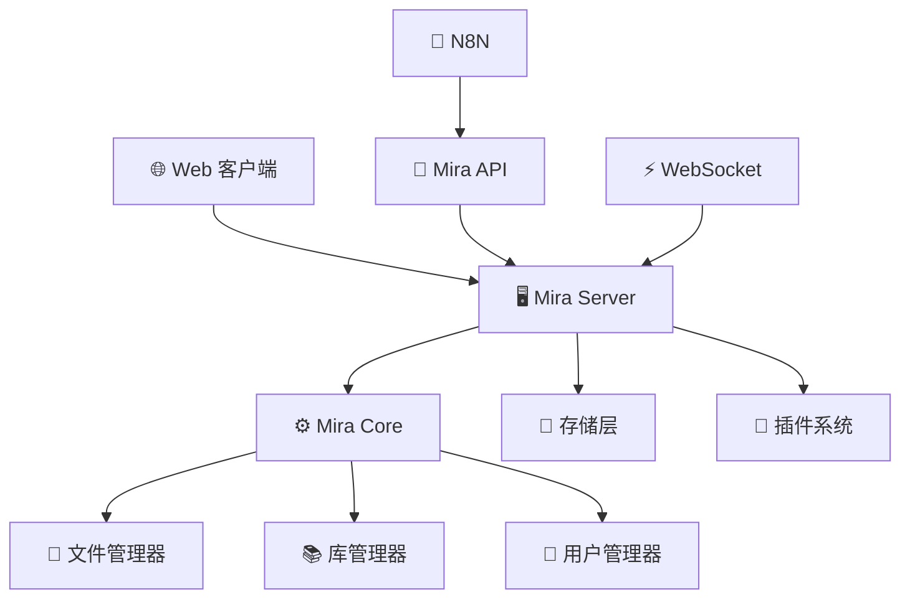

# 🎯 Mira 系统介绍

欢迎了解 Mira —— 一个现代化的智能文件管理与自动化平台！

## 🤔 什么是 Mira？

Mira 是一个功能强大且易于使用的文件管理系统，它不仅提供了传统的文件操作功能，还集成了现代化的自动化能力。通过 Mira，你可以：

- 📁 **管理文件**：上传、下载、组织和分享文件
- 📚 **创建库**：将相关文件组织到不同的库中
- 🔌 **扩展功能**：通过插件系统添加新功能
- ⚡ **自动化工作流**：与 N8N 集成，创建强大的自动化流程
- 👥 **团队协作**：多用户支持，权限管理
- 📊 **监控管理**：实时查看系统状态和设备信息

## 🌟 核心特性

### 🎯 简单易用
- **友好界面**：直观的 Web 界面，无需复杂配置
- **快速上手**：几分钟即可完成安装和配置
- **详细文档**：完整的使用指南和示例

### 🚀 功能强大
- **文件管理**：支持多种文件格式的上传、下载、预览
- **库管理**：灵活的文件库组织和管理
- **用户系统**：完善的用户权限和角色管理
- **插件系统**：丰富的插件生态，无限扩展可能

### 🔗 完美集成
- **N8N 支持**：无缝集成主流自动化平台
- **API 接口**：RESTful API，方便第三方集成
- **WebSocket**：实时事件推送和通信
- **跨平台**：Windows、macOS、Linux 全平台支持

## 🏗️ 系统架构概览

Mira 采用模块化设计，主要包含以下组件：

### 核心组件说明

| 组件 | 说明 |
|------|------|
| **🖥️ Mira Server** | 主服务器，处理所有 HTTP 请求和 WebSocket 连接 |
| **⚙️ Mira Core** | 核心业务逻辑，包含文件、库、用户管理等功能 |
| **💾 存储层** | 数据持久化，支持 SQLite 等数据库 |
| **🔌 插件系统** | 动态加载和管理插件，扩展系统功能 |
| **📡 API 接口** | RESTful API，供外部系统集成使用 |

## 🎯 使用场景

Mira 适用于多种场景，无论你是个人用户还是企业团队：

### 👤 个人用户
- **📁 个人文件管理**：整理和管理个人文档、照片、视频
- **☁️ 私有云盘**：搭建个人云存储服务
- **🔄 文件同步**：在多设备间同步文件
- **🤖 自动化任务**：创建文件处理自动化流程

### 👥 团队协作
- **📚 项目文档管理**：团队文档的集中管理和版本控制
- **🎨 设计资源库**：设计素材的分类存储和分享
- **📊 数据分析**：数据文件的收集、处理和分析
- **🔗 工作流集成**：与现有工作流工具的无缝集成

### 🏢 企业应用
- **📋 文档管理系统**：企业文档的统一管理
- **🔄 业务流程自动化**：文件处理流程的自动化
- **📊 数据中台**：作为数据收集和处理的中转站
- **🔗 系统集成**：与企业现有系统的集成

## 💡 为什么选择 Mira？

### 🆚 与传统文件管理系统的对比

| 特性 | 传统系统 | Mira |
|------|----------|------|
| **易用性** | 复杂配置 | ✅ 开箱即用 |
| **扩展性** | 功能固定 | ✅ 插件系统 |
| **自动化** | 手动操作 | ✅ 工作流集成 |
| **协作** | 基础分享 | ✅ 权限管理 |
| **监控** | 有限信息 | ✅ 实时监控 |
| **API** | 接口有限 | ✅ 完整 API |

### 🌟 独特优势

::: tip ✨ Mira 的独特之处
1. **🎯 简单却强大**：既适合新手快速上手，也能满足高级用户需求
2. **🔧 高度可定制**：通过插件系统可以轻松添加新功能
3. **🔗 自动化友好**：天生支持与 N8N 等自动化平台集成
4. **📊 数据驱动**：提供详细的使用统计和监控信息
5. **🛡️ 安全可靠**：企业级的安全保障和权限控制
6. **🌐 现代化**：采用最新技术栈，性能优异
:::

## 🚀 开始你的 Mira 之旅

准备好开始使用 Mira 了吗？根据你的需求选择合适的入口：

### 🏃‍♂️ 快速体验
如果你想立即体验 Mira 的功能：
- [🚀 快速开始](/quick-start) - 5 分钟快速搭建

### 📖 深入学习
如果你想全面了解 Mira：
- [⚙️ 安装与配置](/guide/installation) - 详细安装指南
- [🏗️ 系统架构](/guide/architecture) - 深入了解系统设计

### 🔧 功能探索
如果你想了解具体功能：
- [📁 文件管理](/guide/file-management) - 文件操作功能
- [📚 库管理](/guide/library-management) - 库的创建和管理
- [🔌 插件系统](/guide/plugin-system) - 扩展系统功能

### 🔗 集成开发
如果你想集成 Mira 到现有系统：
- [📋 API 概览](/api/overview) - 完整 API 文档
- [🔗 N8N 集成](/n8n/overview) - 自动化工作流

## 🤝 社区与支持

Mira 是一个开源项目，我们欢迎社区的参与和贡献：

- **📖 文档改进**：帮助完善文档和教程
- **🐛 问题反馈**：报告 bug 和提出改进建议
- **💡 功能建议**：分享你的想法和需求
- **🔧 代码贡献**：参与代码开发和维护

加入我们：
- [GitHub Repository](https://github.com/hunmer/mira_typescript)
- [GitHub Discussions](https://github.com/hunmer/mira_typescript/discussions)
- [GitHub Issues](https://github.com/hunmer/mira_typescript/issues)

---

准备好开始探索 Mira 的强大功能了吗？让我们开始吧！🚀
