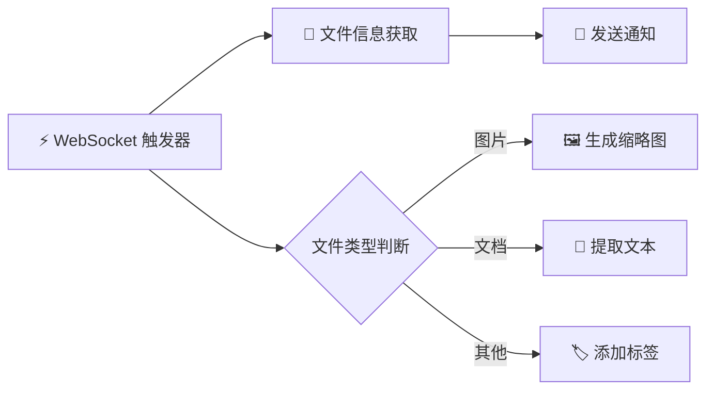
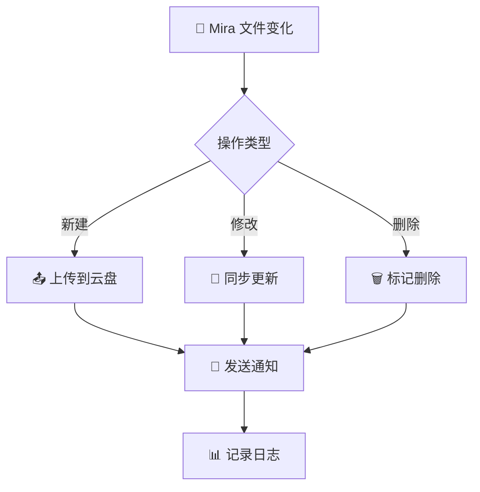
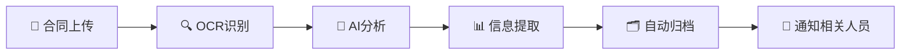
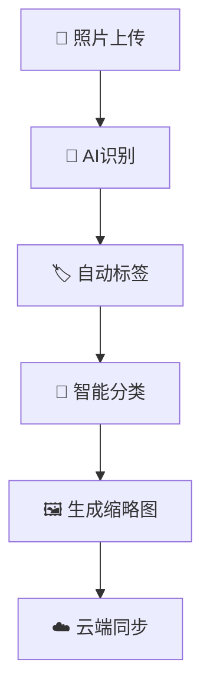

# 🔗 N8N 集成概览

Mira 与 N8N 的深度集成让你能够构建强大的自动化工作流，实现文件处理、数据同步、通知推送等复杂业务流程的自动化。

## 🎯 为什么选择 N8N + Mira？

### 🚀 强大组合
- **📁 文件管理** + **🔄 自动化流程** = 无限可能
- **⚡ 实时事件** + **📊 数据处理** = 高效响应
- **🔌 丰富节点** + **🎯 专业功能** = 灵活定制

### 💡 典型应用场景

::: tip 🌟 热门使用场景
- **📸 照片自动分类**：上传照片后自动识别、分类、生成缩略图
- **📄 文档处理流程**：PDF 转换、内容提取、格式标准化
- **📊 数据同步**：多系统间的文件和数据同步
- **🔔 智能通知**：文件变化时发送邮件、短信或即时消息
- **🏷️ 自动标签**：基于文件内容自动添加标签和元数据
- **🗂️ 定期归档**：按规则自动归档和清理旧文件
:::

## 📦 集成组件

Mira 为 N8N 提供了两个核心组件：

### 🔧 Mira API 节点
一套完整的 N8N 节点，涵盖 Mira 的所有核心功能：

| 节点类型 | 功能 | 数量 |
|----------|------|------|
| **🔐 认证节点** | 登录、登出、权限验证 | 4个 |
| **📁 文件节点** | 上传、下载、删除文件 | 3个 |
| **📚 库节点** | 库的完整生命周期管理 | 8个 |
| **🔌 插件节点** | 插件安装、管理、控制 | 6个 |
| **👥 用户节点** | 用户和管理员管理 | 5个 |
| **📊 设备节点** | 设备监控和管理 | 5个 |
| **💾 数据库节点** | 数据查询和操作 | 3个 |
| **🔍 系统节点** | 系统状态和健康检查 | 2个 |

### ⚡ WebSocket 触发器
实时事件监听节点，让你的工作流能够：

- **📡 实时响应**：文件上传、删除等事件发生时立即触发
- **🎯 精确过滤**：只监听你关心的特定事件类型
- **🔄 自动重连**：网络断开时自动重连，确保可靠性
- **📊 状态监控**：提供连接状态和事件统计信息

## 🛠️ 快速开始

### 1️⃣ 安装 Mira 节点

```bash
# 在你的 N8N 环境中安装
npm install n8n-nodes-mira-apis
```

### 2️⃣ 配置 Mira 凭据

在 N8N 中创建 Mira API 凭据：
- **服务器 URL**: `http://localhost:8081`
- **用户名**: 你的 Mira 用户名
- **密码**: 你的 Mira 密码

### 3️⃣ 创建第一个工作流



## 🎨 工作流示例

### 📸 智能照片管理

当用户上传照片时自动处理：

```json
{
  "nodes": [
    {
      "name": "照片上传监听",
      "type": "mira-websocket-trigger",
      "parameters": {
        "events": "file::uploaded",
        "filter": "*.jpg,*.png,*.jpeg"
      }
    },
    {
      "name": "生成缩略图",
      "type": "image-resize",
      "parameters": {
        "width": 200,
        "height": 200
      }
    },
    {
      "name": "AI图片识别",
      "type": "openai-vision",
      "parameters": {
        "prompt": "描述这张图片的内容"
      }
    },
    {
      "name": "自动分类",
      "type": "mira-file-update",
      "parameters": {
        "tags": "{{ $node['AI图片识别'].json.category }}"
      }
    }
  ]
}
```

### 📄 文档处理流程

自动处理上传的文档：

```json
{
  "workflow": {
    "trigger": "文档上传",
    "steps": [
      {
        "name": "PDF转换",
        "action": "convert-to-pdf",
        "condition": "fileType != 'pdf'"
      },
      {
        "name": "OCR文字识别",
        "action": "extract-text",
        "condition": "isImage || isPDF"
      },
      {
        "name": "关键词提取",
        "action": "nlp-keywords",
        "input": "extractedText"
      },
      {
        "name": "自动归档",
        "action": "move-to-folder",
        "folder": "{{ categories[keywords[0]] }}"
      }
    ]
  }
}
```

### 🔄 多系统同步

在不同系统间同步文件：



## 🔧 高级功能

### 🎯 事件过滤

WebSocket 触发器支持精确的事件过滤：

```javascript
// 只监听特定库的文件事件
filter: "library_id:library_123"

// 只监听图片文件
filter: "file_type:image/*"

// 组合条件
filter: "library_id:lib_123 AND file_type:image/*"

// 排除条件
filter: "NOT file_type:temp/*"
```

### 🔄 错误处理和重试

```json
{
  "errorHandling": {
    "retries": 3,
    "retryDelay": 1000,
    "onError": "continue",
    "fallback": {
      "action": "log-error",
      "notify": true
    }
  }
}
```

### 📊 性能优化

```json
{
  "performance": {
    "batchSize": 10,
    "parallel": true,
    "maxConcurrency": 5,
    "timeout": 30000
  }
}
```

## 🎓 学习路径

### 🚀 新手入门
1. [📦 安装配置](/n8n/installation) - 基础安装和配置
2. [🔧 Mira API 节点](/n8n/mira-api-nodes) - 了解可用节点
3. [📖 使用示例](/n8n/examples) - 跟随示例学习

### 💡 进阶使用
1. [⚡ WebSocket 触发器](/n8n/websocket-trigger) - 实时事件处理
2. [🔧 高级配置](/n8n/advanced-config) - 性能优化和调优

### 🏆 专家级别
1. [🎨 自定义节点开发](/n8n/custom-nodes) - 开发专属节点
2. [🔗 企业级集成](/n8n/enterprise) - 大规模部署方案
3. [📊 监控和运维](/n8n/monitoring) - 生产环境管理

## 💼 企业级特性

### 🔒 安全性
- **🛡️ 端到端加密**：数据传输全程加密
- **👤 身份验证**：完整的用户认证体系
- **🔐 权限控制**：细粒度的访问权限管理
- **📝 审计日志**：完整的操作记录追踪

### 📈 可扩展性
- **⚡ 高性能**：支持大文件和高并发处理
- **🔄 负载均衡**：多实例部署支持
- **📊 监控告警**：实时性能和状态监控
- **🔧 自动恢复**：故障自动检测和恢复

### 🎯 可靠性
- **💾 数据备份**：自动数据备份和恢复
- **🔄 故障转移**：服务高可用保障
- **📊 健康检查**：系统状态实时监控
- **🚨 智能告警**：异常情况及时通知

## 🌟 成功案例

### 📋 案例一：自动化文档管理

**背景**：某公司每天接收大量合同文档，需要自动分类、提取关键信息并归档。

**解决方案**：


**效果**：
- ⏱️ 处理时间从 30 分钟缩短到 2 分钟
- 🎯 准确率达到 95% 以上
- 💰 人工成本节省 80%

### 📋 案例二：智能照片库

**背景**：摄影工作室需要自动整理大量照片，按主题分类并生成预览图。

**解决方案**：


**效果**：
- 📊 照片分类准确率 90%+
- ⚡ 处理速度提升 10 倍
- 🎯 客户满意度显著提升

## 🤝 社区与支持

### 💬 获取帮助
- **📖 文档**：完整的使用指南和 API 文档
- **💡 示例库**：丰富的工作流模板和示例
- **🗣️ 社区论坛**：与其他用户交流经验
- **🐛 问题反馈**：快速的问题响应和解决

### 🎯 参与贡献
- **📝 文档改进**：帮助完善文档和教程
- **🔧 功能建议**：提出新功能需求
- **🐛 问题报告**：反馈使用中的问题
- **💡 经验分享**：分享最佳实践和成功案例

---

准备好开始构建你的自动化工作流了吗？让我们从 [📦 安装配置](/n8n/installation) 开始！🚀
